# SysAlmacen

Este proyecto contiene pruebas unitarias de repositorios JPA y un conjunto de capturas que se muestran automáticamente en GitHub desde este README.

## Cómo ejecutar pruebas
- Ejecuta `mvn -q test` para correr todo el suite.
- Si deseas usar la BD de pruebas, ejecuta con `-Dspring.profiles.active=test`.

## Capturas de pruebas
Las siguientes imágenes se referencian por ruta relativa dentro del repositorio, por lo que GitHub las mostrará como vista previa automáticamente.

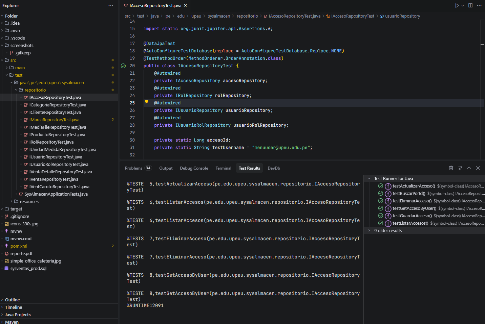
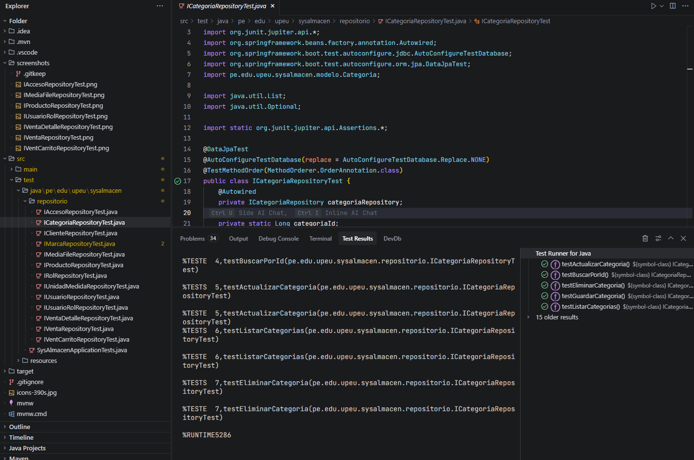
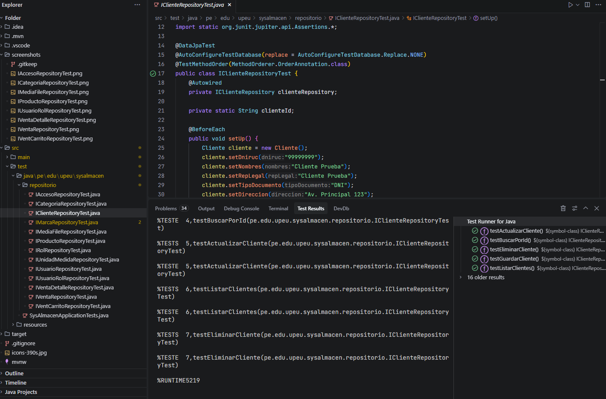
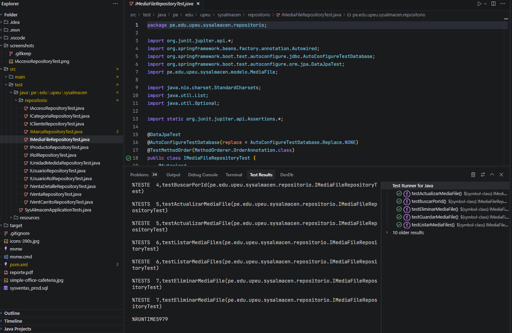
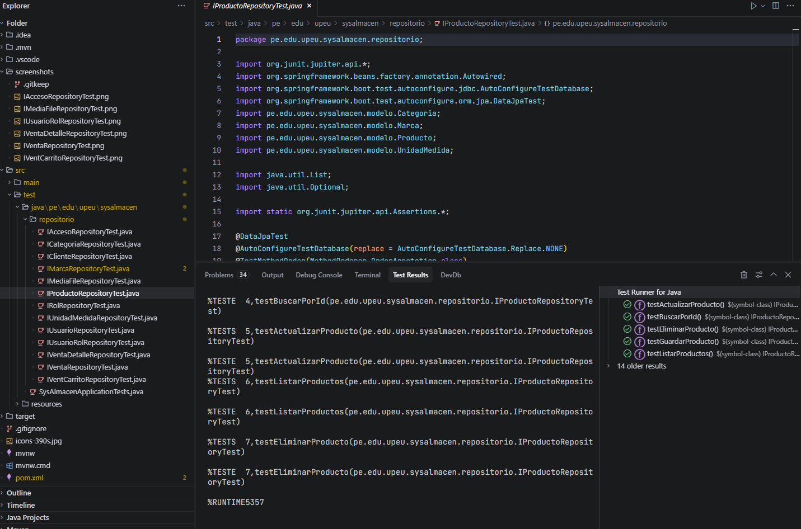
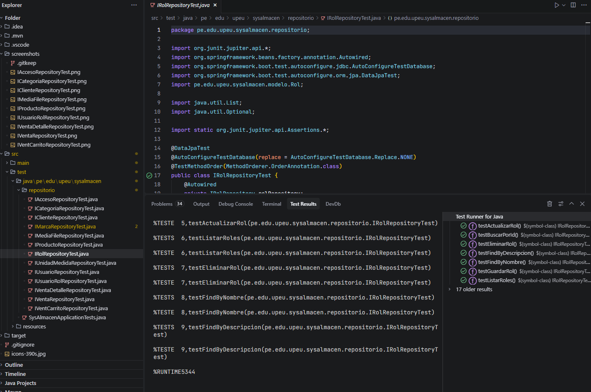
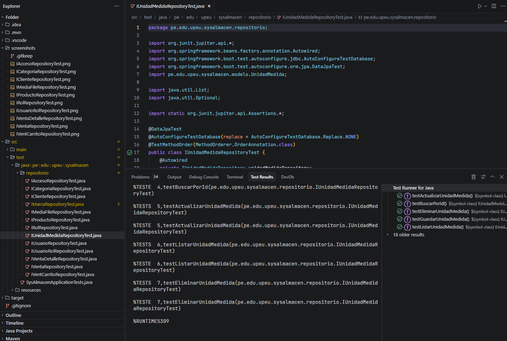
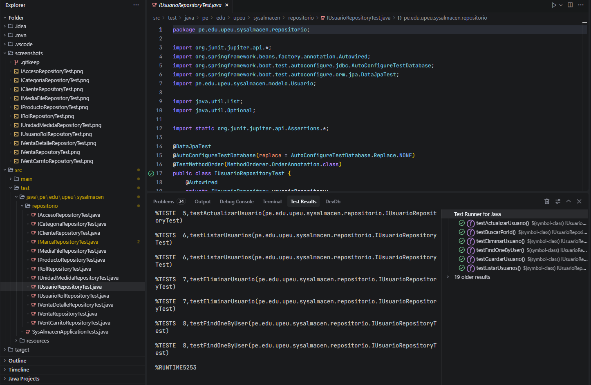
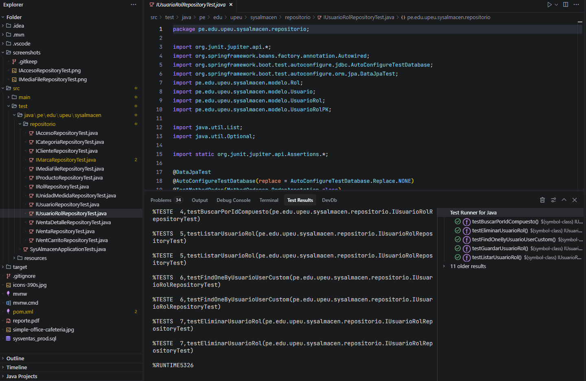
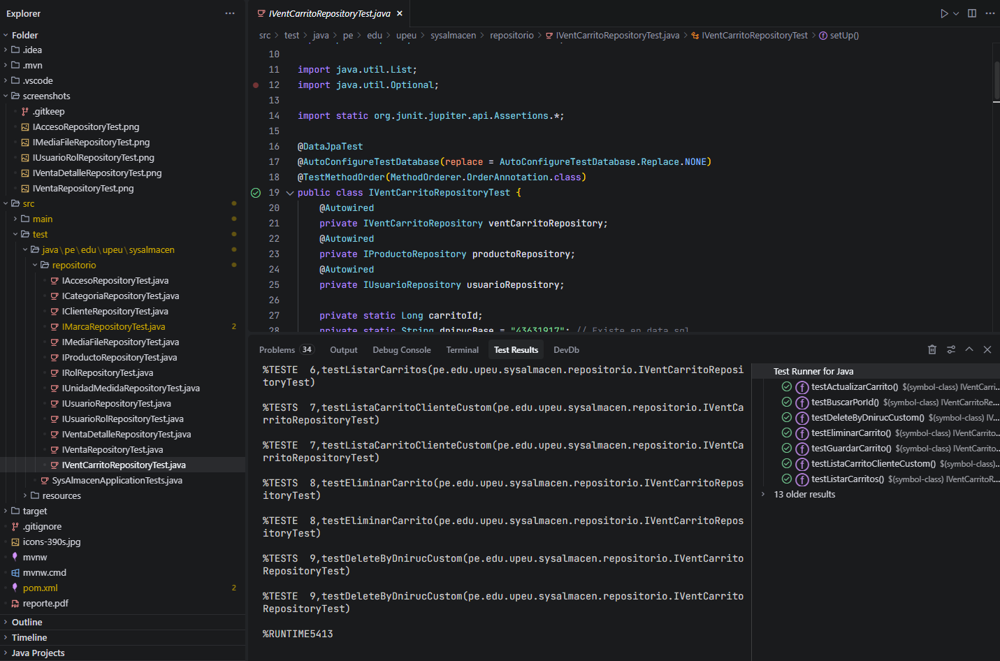
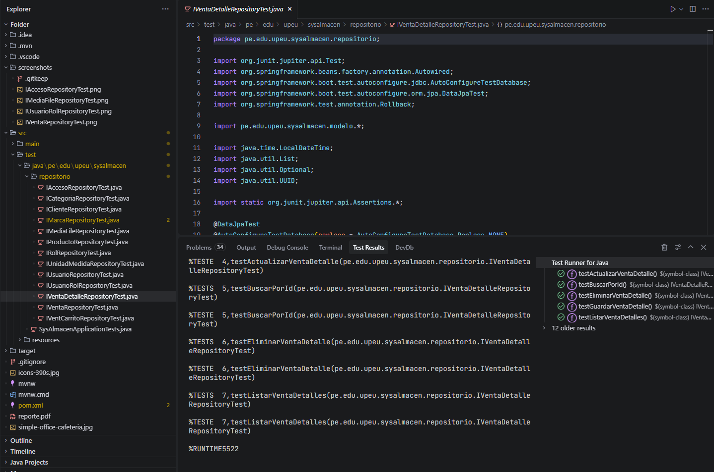
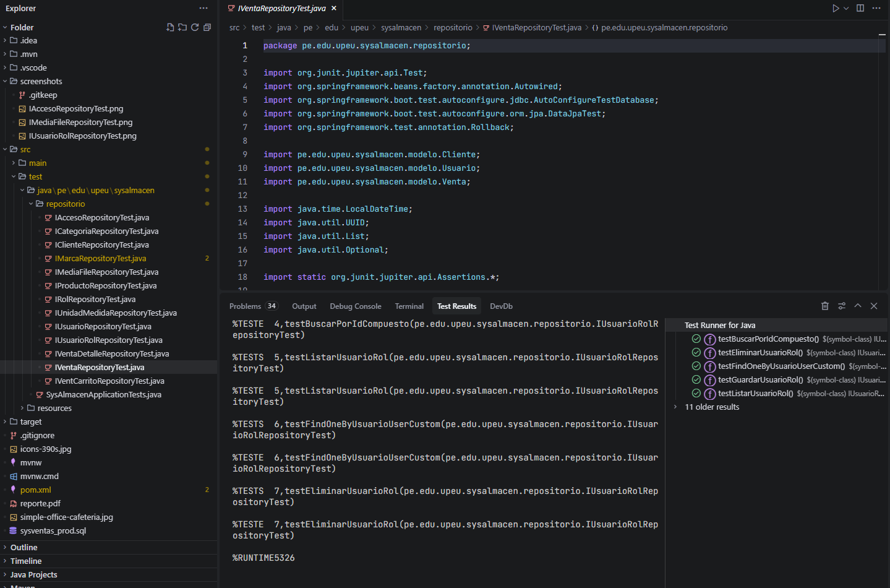

## Notas
- Asegúrate de versionar la carpeta `screenshots/` junto con el README para que las imágenes se muestren en GitHub.
- Usa rutas relativas (como `screenshots/archivo.png`) para garantizar la visualización correcta.